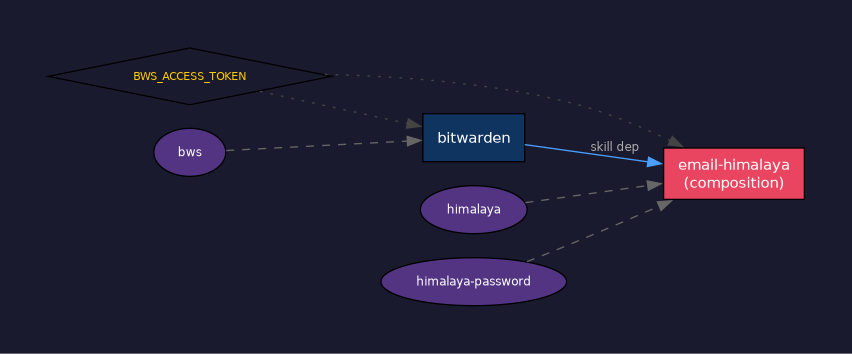

# hermes-skills

Reusable skills and a dependency verification system for [Hermes Agent](https://github.com/NousResearch/hermes-agent).

## What's here

**3 skills** you can drop into `~/.hermes/skills/` and use immediately, plus **3 tools** that verify dependencies, visualize the skill graph, and suggest new skills from your session history.

## Skill Graph

Skills can declare what they depend on — tools, env vars, other skills — and define multi-step composition tests. The system verifies everything works end-to-end.



### Example: how skills chain together

```
bitwarden skill          email-himalaya skill
┌──────────────┐         ┌─────────────────────────┐
│ tools: [bws] │────────▶│ skills: [bitwarden]      │
│ env: [BWS_   │         │ tools: [himalaya]        │
│  ACCESS_     │         │ composition:             │
│  TOKEN]      │         │   bws → password →       │
│ verify:      │         │   himalaya → email list  │
│  bws --ver   │         └─────────────────────────┘
└──────────────┘
```

### Demo: `skill-graph-test`

```
━━━ bitwarden ━━━
  ✅ tool: bws
  ✅ env: BWS_ACCESS_TOKEN
  ✅ verify: bws --version
  ✅ verify: bws secret list

━━━ email-himalaya ━━━
  ✅ tool: himalaya
  ✅ skill: bitwarden
  ✅ verify: himalaya --version
  composition: bws-to-himalaya-auth
  ✅   step1: password retrieval
  ✅   step2: himalaya connects to IMAP

━━━ PII scan ━━━
  ✅ bitwarden: clean
  ✅ email-himalaya: clean
  ✅ skill-autoresearch: clean

  RESULT: 18/18 passed, 0 failed
```

### Demo: `skill-graph-extract`

Analyzes your Hermes sessions and finds patterns:

```
Sessions analyzed: 14
CLI commands extracted: 125

━━━ CLI Tool Usage ━━━
   38x himalaya     ✅ covered by skill
   22x bws          ✅ covered by skill

━━━ Composition Candidates ━━━
  4x bws → himalaya  (already have email-himalaya skill)
```

When it finds tools you use frequently but have no skill for, it suggests creating one.

## Skills

### [bitwarden](bitwarden/SKILL.md)

Bitwarden Secrets Manager CLI (`bws`) integration. Native `bws run` for secret injection, verified against official Bitwarden CLI docs.

### [email-himalaya](email-himalaya/SKILL.md)

Composition skill — chains bitwarden → himalaya for secure email without plaintext passwords.

### [skill-autoresearch](skill-autoresearch/SKILL.md)

Automated evaluation and improvement loop. Point it at any SKILL.md or script: frozen benchmark → diagnose → external verification → patch → KEEP/REVERT. Finds outdated commands, missing guardrails, PII in examples.

Inspired by [Karpathy's autoresearch](https://x.com/karpathy/status/1886192184808149383).

## Tools

| Tool | What it does |
|------|-------------|
| `skill-graph-test` | Verify all dependencies, run compositions, scan for PII |
| `skill-graph-viz` | Generate dependency graph as PNG |
| `skill-graph-extract` | Analyze Hermes sessions, suggest new skills |

## Adding dependencies to your own skills

Add a `dependencies` block to your SKILL.md frontmatter:

```yaml
---
name: my-skill
dependencies:
  tools: [docker, kubectl]
  env: [KUBECONFIG]
  skills: [cloud-auth]
  verify:
    - cmd: "kubectl cluster-info"
      expect: "running"
  compositions:
    - name: "deploy-flow"
      steps:
        - cmd: "docker build -t app . 2>&1 | tail -1"
          expect: "Successfully"
        - cmd: "kubectl apply -f deploy.yaml 2>&1"
          expect: "configured"
---
```

Then run `skill-graph-test` to verify everything works.

## Installation

```bash
# Skills
cp -r bitwarden/ ~/.hermes/skills/bitwarden/
cp -r email-himalaya/ ~/.hermes/skills/email-himalaya/
cp -r skill-autoresearch/ ~/.hermes/skills/skill-autoresearch/

# Tools
install tools/skill-graph-test ~/.local/bin/
install tools/skill-graph-viz ~/.local/bin/
install tools/skill-graph-extract ~/.local/bin/

# Dependencies (for viz only)
pip install graphviz  # Python package
# Plus: graphviz system package (apt install graphviz / zypper install graphviz)
```

## License

MIT
